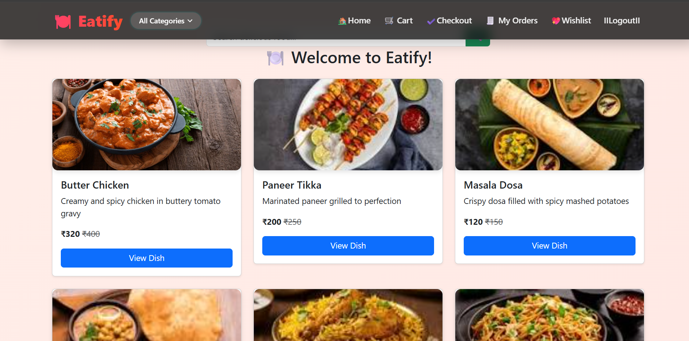
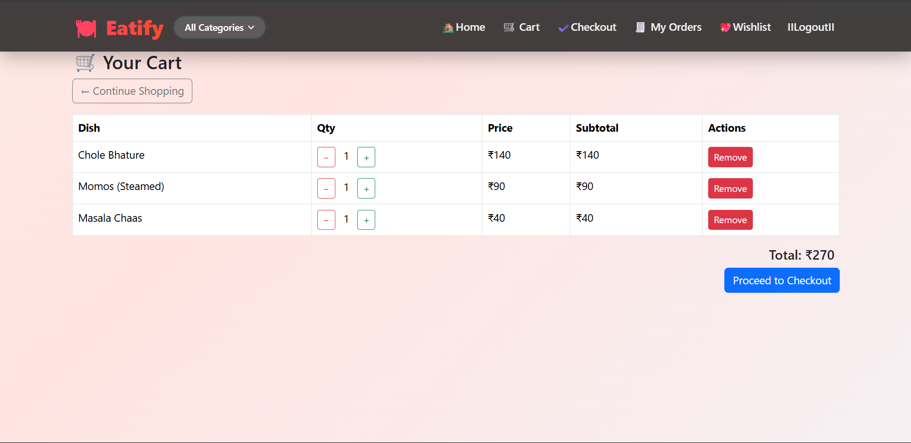
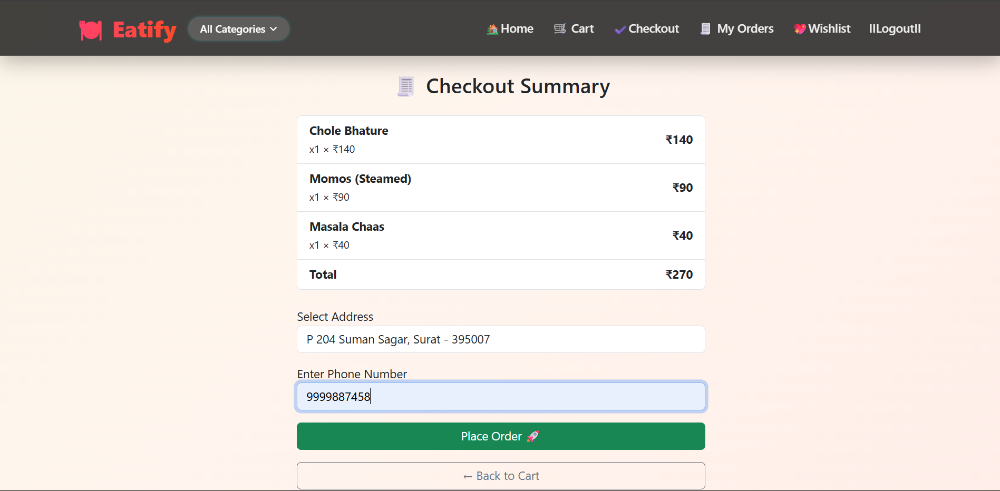
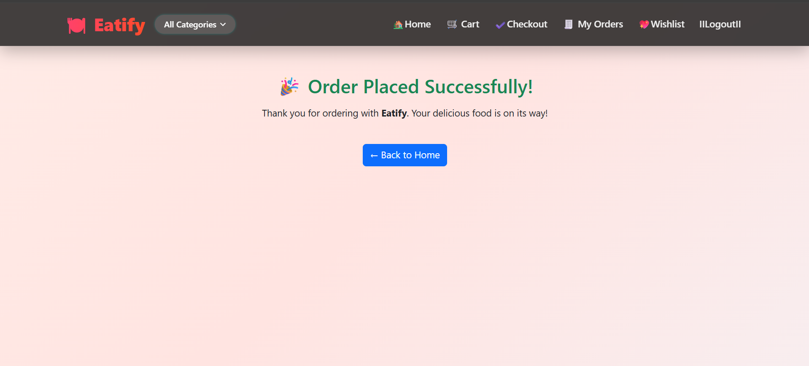
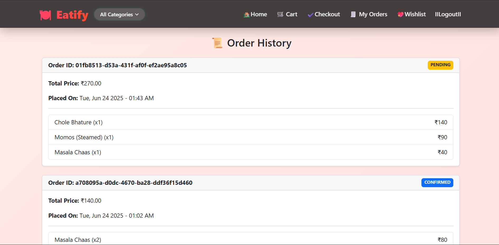

# Eatify
Eatify is a feature-rich online food ordering platform built using Django. It allows users to browse food items, add them to cart, place orders, and pay securely using an integrated payment gateway (Cashfree). The app includes wishlist, address management, order history, and admin food control.

## 📸 Screenshots

### 🏠 Home Page

### 🛒 Cart Page

### 🛒 Checkout Page

### ✅ Order Success

### 🛒 Order History

