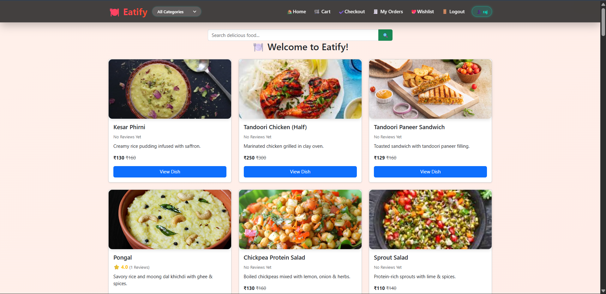
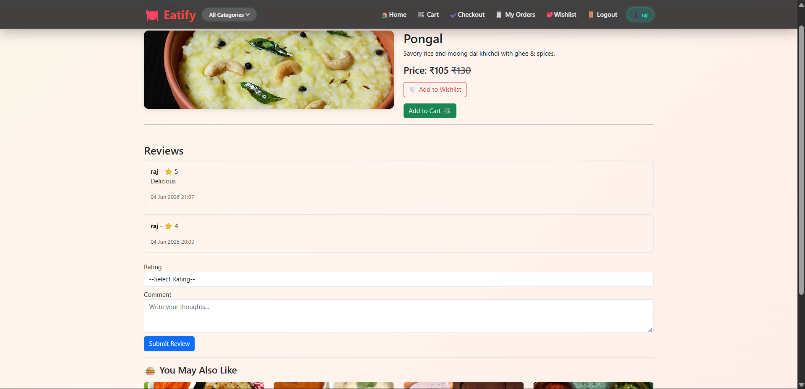
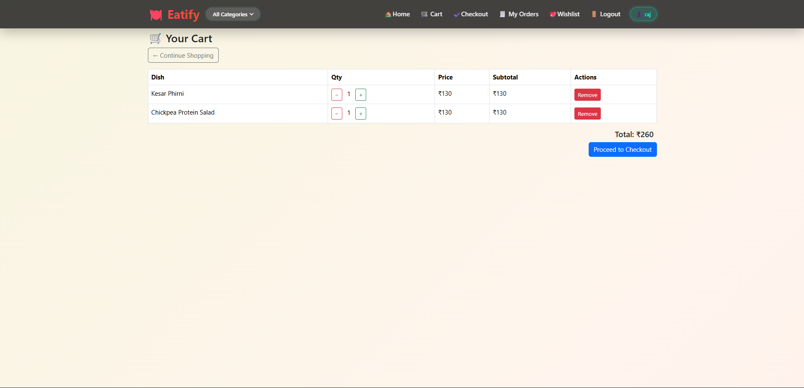
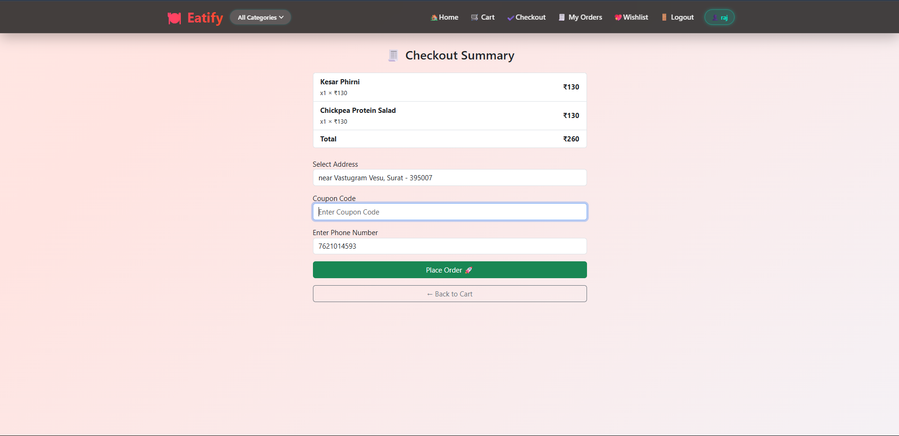
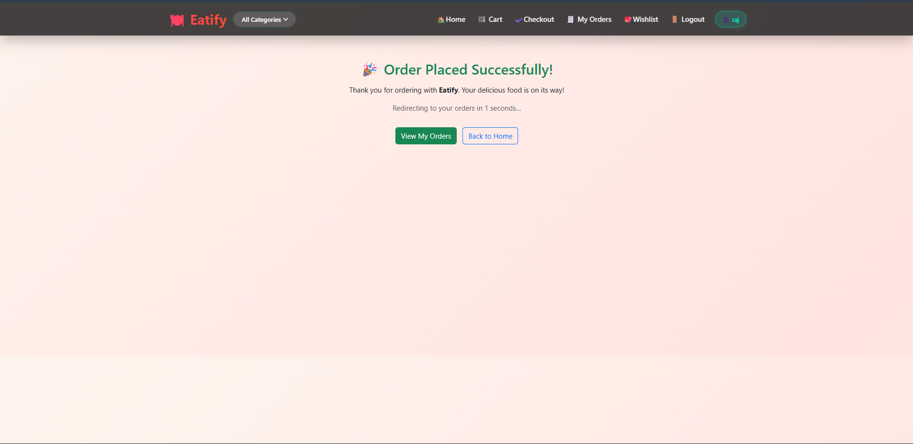
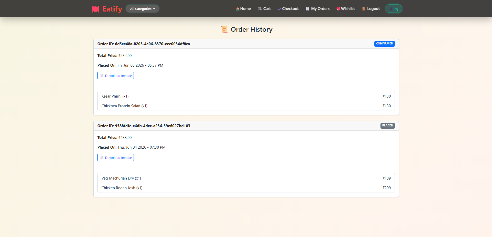
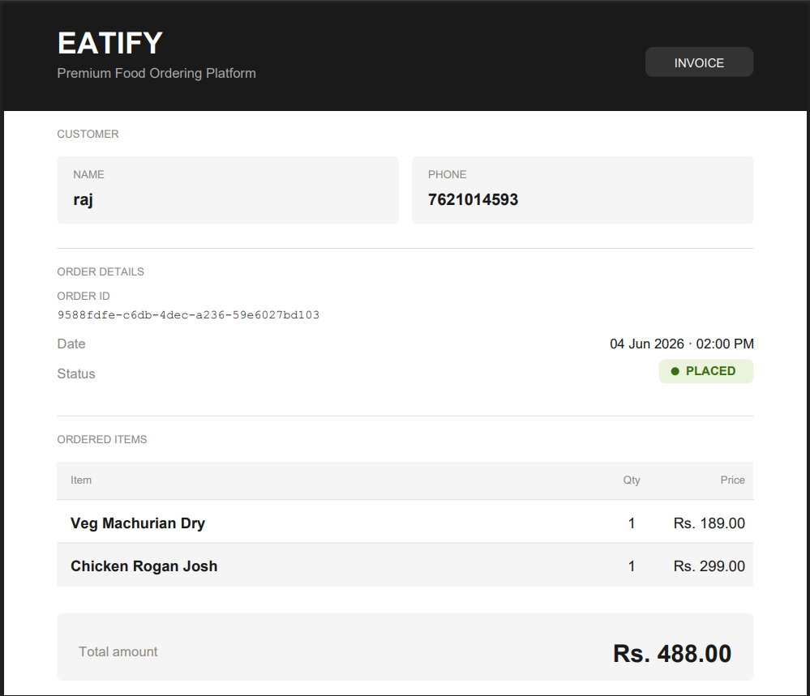
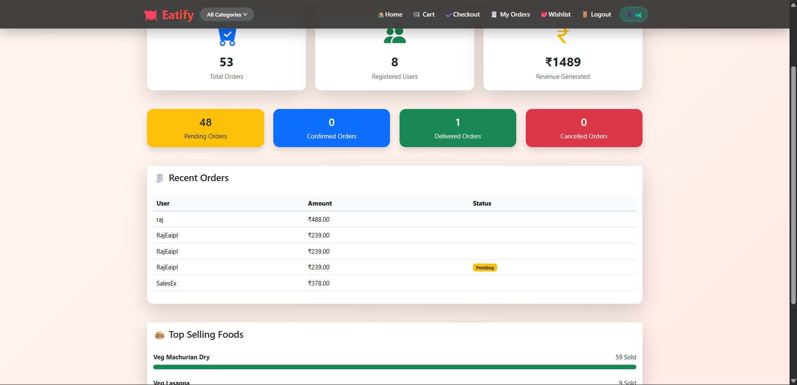

# 🍽️ Eatify

Eatify is a full-stack food ordering web application built with Django that allows users to browse food items, add them to their cart, manage wishlists, place orders, make secure online payments, download invoices, and track their order history.

The platform provides a complete food ordering experience along with an admin analytics dashboard for monitoring business performance.

---

## 🚀 Live Demo

**Live Website:** https://eatify-eyn1.onrender.com

---

## 📸 Screenshots

### 🏠 Home Page



### 🍔 Food Detail Page



### 🛒 Cart Page



### ✅ Checkout Page



### 🎉 Order Success Page



### 📜 Order History



### 📄 PDF Invoice



### 📊 Admin Analytics Dashboard



---

## ✨ Features

### 👤 Authentication System

* User Registration
* User Login
* User Logout
* Forgot Password
* Secure Authentication using Django Authentication System

### 🍔 Food Management

* Browse Food Items
* Food Categories
* Food Detail Pages
* Food Images
* Food Descriptions
* Food Pricing

### 🔍 Search Functionality

* Search by Food Name
* Search by Description
* Search by Category

### ⭐ Review & Rating System

* Add Reviews
* Give Ratings
* Average Rating Calculation
* Review Count Display

### ❤️ Wishlist System

* Add Food to Wishlist
* Remove Food from Wishlist
* Personalized Wishlist Management

### 🛒 Cart System

* Add to Cart
* Increase Quantity
* Decrease Quantity
* Remove Items
* Real-Time Cart Total Calculation

### 📍 Address Management

* Add Delivery Addresses
* Select Address During Checkout

### 💳 Payment Gateway Integration

* Cashfree Payment Gateway
* Secure Online Payments
* Payment Verification
* Order Status Updates

### 🎟️ Coupon System

* Apply Coupon Codes
* Percentage Based Discounts
* Coupon Validation
* Discounted Checkout Amount

### 📦 Order Management

* Place Orders
* Order History
* Order Status Tracking
* Customer Order Records

### 📄 Invoice Generation

* PDF Invoice Download
* Order Details
* Customer Information
* Professional Invoice Layout

### 🤖 Recommendation System

* Category Based Food Recommendations
* Related Food Suggestions

### 📊 Admin Analytics Dashboard

* Total Orders
* Total Users
* Total Revenue
* Order Status Analytics
* Recent Orders
* Top Selling Foods

---

## 🛠️ Tech Stack

### Backend

* Python
* Django

### Frontend

* HTML5
* CSS3
* Bootstrap 5
* JavaScript

### Database

* SQLite3

### Payment Gateway

* Cashfree

### Deployment

* Render

### PDF Generation

* ReportLab

---

## 📂 Project Structure

```text
Eatify/
│
├── Eatify/
│   ├── models.py
│   ├── views.py
│   ├── urls.py
│   ├── admin.py
│
├── templates/
├── static/
├── media/
├── screenshots/
├── db.sqlite3
├── manage.py
└── requirements.txt
```

---

## ⚙️ Installation

### Clone Repository

```bash
git clone YOUR_GITHUB_REPOSITORY_URL
```

### Navigate to Project

```bash
cd Eatify
```

### Create Virtual Environment

```bash
python -m venv env
```

### Activate Environment

Windows:

```bash
env\Scripts\activate
```

Linux/Mac:

```bash
source env/bin/activate
```

### Install Requirements

```bash
pip install -r requirements.txt
```

### Run Migrations

```bash
python manage.py migrate
```

### Create Superuser

```bash
python manage.py createsuperuser
```

### Run Server

```bash
python manage.py runserver
```

---

## 🔐 Environment Variables

Create a `.env` file and configure:

```env
SECRET_KEY=your_secret_key

CASHFREE_APP_ID=your_cashfree_app_id
CASHFREE_SECRET_KEY=your_cashfree_secret_key
CASHFREE_API_URL=your_cashfree_api_url
CASHFREE_RETURN_URL=your_cashfree_return_url

EMAIL_HOST_USER=your_email
EMAIL_HOST_PASSWORD=your_password
```

---

## 📈 Future Enhancements

* Email Invoice Delivery
* Food Recommendation Using AI
* Real-Time Order Tracking
* User Profile Management
* Multiple Payment Methods
* Sales Analytics Charts
* REST API Integration
* Mobile Application

---

## 👨‍💻 Author

**Raj Patil**

Master of Information Technology

Built as a full-stack Django project to demonstrate backend development, payment integration, database management, authentication systems, and deployment skills.

---

## ⭐ Support

If you found this project useful, consider giving it a ⭐ on GitHub.
